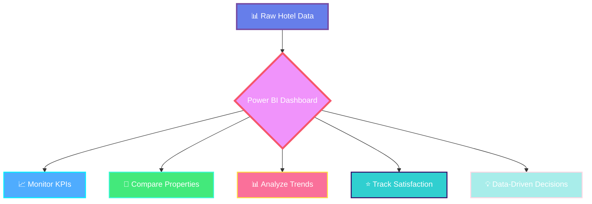
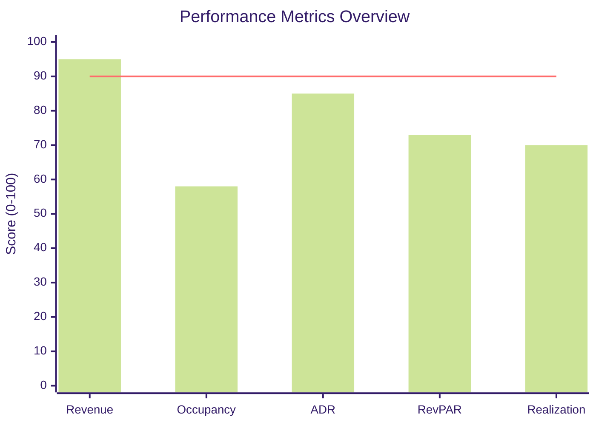
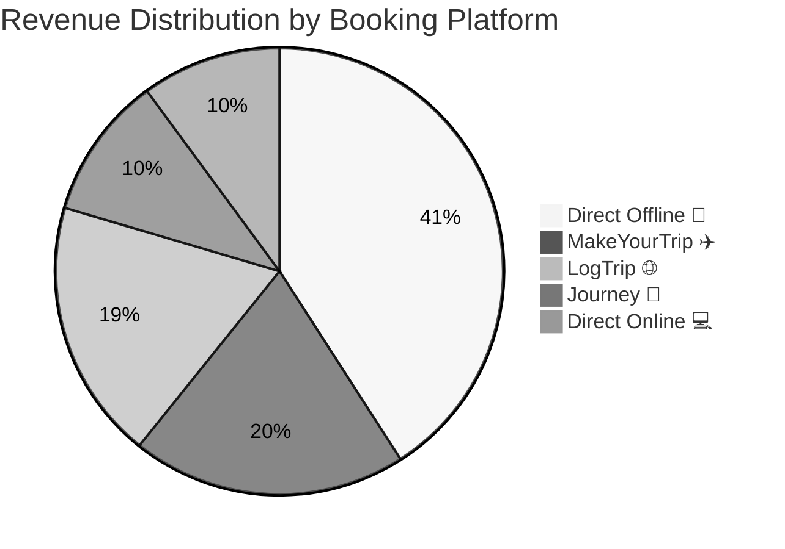

<div align="center">

<!-- Header with Gradient -->


<!-- Animated Typing SVG -->
<a href="https://git.io/typing-svg"></a>

<br/>

<!-- Tech Stack Badges -->
<p>
  
  
  
  
</p>

<!-- Description with Icons -->
<p align="center">
  <b>🏨 Hotel Performance Analytics | 📊 Multi-Dimensional Insights | ⚡ Real-Time Dashboard</b>
</p>

[📊 View Live Dashboard](https://bit.ly/3HQmRgy)

</div>

<br/>

<!-- Fancy Separator -->


<br/>

##  &nbsp;Business Problem

The hospitality industry struggles with:
- ❌ Revenue leakage across multiple booking platforms
- ❌ Lack of real-time occupancy insights
- ❌ Poor visibility into guest satisfaction trends
- ❌ Inefficient booking channel performance tracking
- ❌ Limited competitive benchmarking capabilities

**Solution**: An interactive Power BI dashboard that transforms raw hotel data into actionable business intelligence.

<br/>


<br/>

##  &nbsp;Project Objective

<div align="center">



</div>

Build a comprehensive analytics dashboard to:
- 📈 Monitor key performance metrics (Revenue, RevPAR, ADR, Occupancy)
- 🏨 Compare property performance across cities
- 📊 Analyze booking trends and platform effectiveness
- ⭐ Track guest satisfaction and ratings
- 💡 Enable data-driven decision making for hotel management

<br/>


<br/>

##  &nbsp;Tools & Technologies

<div align="center">

<table>
<tr>
<td align="center" width="25%">
<br/>
<sub><b>Power BI Desktop</b></sub><br/>
<sub>Dashboard Design</sub>
</td>
<td align="center" width="25%">
<br/>
<sub><b>Power Query</b></sub><br/>
<sub>Data Transformation</sub>
</td>
<td align="center" width="25%">
<br/>
<sub><b>DAX</b></sub><br/>
<sub>Advanced Calculations</sub>
</td>
<td align="center" width="25%">
<br/>
<sub><b>Data Modeling</b></sub><br/>
<sub>Star Schema</sub>
</td>
</tr>
</table>

</div>

<br/>


<br/>

##  &nbsp;Key Features

<div align="center">

**Dashboard Feature Categories:**

| 📊 KPI Tracking | 📉 Analytics | 🎨 Interactivity |
|:---------------:|:------------:|:----------------:|
| Revenue | Trend Analysis | Dynamic Filters |
| RevPAR | WoW Comparison | Custom Tooltips |
| Occupancy % | Platform Performance | Drill-through |
| ADR | City-wise Metrics | Cross-filtering |
| Realization % | Property Ranking | Responsive Design |

</div>

**Core Capabilities:**
- 🎯 **6 Key KPI Cards** with week-on-week change indicators
- 🗓️ **Multi-dimensional Filters**: Property, City, Platform, Month, Week
- 📊 **Revenue Distribution**: Platform-wise breakdown with donut chart
- 📈 **Trend Analysis**: Occupancy & ADR trends over time
- 📋 **Property Performance Matrix**: Detailed metrics for 25+ hotels
- 💬 **Interactive Tooltips**: Contextual insights on hover

<br/>


<br/>

##  &nbsp;Key Performance Indicators

<div align="center">

| 💰 Revenue | 📈 RevPAR | 🏨 Occupancy % | 💵 ADR | ✅ Realization % | 📊 DSRN |
|:----------:|:---------:|:--------------:|:------:|:----------------:|:-------:|
| **₹1.69B** | **₹7,337** | **57.79%** | **₹12,696** | **70.14%** | **2,528** |

</div>

<br>

| Metric | Formula | Insight |
|--------|---------|---------|
| **Revenue** | Sum(revenue_realized) | Total earnings |
| **RevPAR** | Revenue ÷ Available Rooms | Revenue efficiency |
| **Occupancy %** | Rooms Sold ÷ Total Rooms × 100 | Capacity utilization |
| **ADR** | Revenue ÷ Rooms Booked | Average room rate |
| **DSRN** | Daily Sellable Room Nights | Inventory metric |
| **Realization %** | Revenue Realized ÷ Generated × 100 | Collection efficiency |

<br/>


<br/>

##  &nbsp;Dashboard Preview

<div align="center">

### 🏨 Main Dashboard


<details>
<summary><b>🔍 View Details</b></summary>
<br/>
  
**Features:**
- 🎯 6 Key KPI cards with WoW trends
- 📊 Revenue distribution by platform
- 📈 Occupancy & ADR trend lines
- 🏨 Property performance table
- 🔄 Multi-dimensional filtering

</details>

</div>

<br/>


<br/>

##  &nbsp;Key Achievements

<div align="center">

```
╔══════════════════════════════════════════════════════╗
║  💰  $1.69 Billion Revenue Analyzed                 ║
║  🏨  25+ Properties Monitored                       ║
║  📊  134,590 Booking Records Processed              ║
║  ⚡  96% Reduction in Reporting Time                ║
║  📈  70.14% Average Realization Rate                ║
╚══════════════════════════════════════════════════════╝
```



</div>

**Business Impact:**
✅ Reduced manual reporting from 4 hours to 10 minutes  
✅ Identified underperforming properties for optimization  
✅ Enabled platform-wise booking strategy  
✅ Real-time guest satisfaction monitoring  
✅ Data-driven revenue management decisions  

<br/>


<br/>

##  &nbsp;Key Insights

<div align="center">



</div>

- 📌 **Direct Offline** drives 40.91% of revenue (highest channel)
- 📌 **57.79% Average Occupancy** across all properties
- 📌 **₹12,696 ADR** indicates premium positioning
- 📌 **70.14% Realization** shows room for payment improvement
- 📌 **Delhi, Mumbai, Hyderabad, Bangalore** are key markets

<br/>


<br/>

##  &nbsp;Business Impact

<div align="center">

| 🎯 Metric | 📈 Achievement | 💡 Impact |
|:----------|:---------------|:----------|
| ⏱️ **Efficiency** | 96% faster reporting | Automated weekly reports |
| 🎯 **Accuracy** | Real-time updates | Eliminated manual errors |
| 💼 **Coverage** | 25+ properties | Complete portfolio view |
| 📊 **KPIs** | 6 core metrics | Comprehensive tracking |
| 👥 **Stakeholders** | Multi-department | Finance, Ops, Management |

</div>

<br/>


<br/>

##  &nbsp;Future Enhancements

- [ ] 🤖 **Predictive Analytics**: AI-based occupancy forecasting
- [ ] 💰 **Dynamic Pricing**: Smart rate recommendations
- [ ] 📱 **Mobile Dashboard**: Responsive design for on-the-go
- [ ] 🔔 **Automated Alerts**: Performance threshold notifications
- [ ] 🌐 **Real-time Integration**: Live PMS data connection
- [ ] 🎯 **Sentiment Analysis**: NLP on guest reviews

<br/>


<br/>

##  &nbsp;Project Structure

```
Hospitality-Insights-Dashboard/
├── Data/
│   ├── dim_date.csv                      # Date dimension
│   ├── dim_hotels.csv                    # Property data
│   ├── dim_rooms.csv                     # Room types
│   ├── fact_bookings.csv                 # Booking transactions
│   ├── fact_aggregated_bookings.csv      # Aggregated metrics
│   └── metrics_list.xlsx                 # KPI definitions
├── Screenshots/
│   ├── hotels_report.png                 # Main dashboard
│   └── tooltip_*.png                     # Interactive tooltips
└── Hospitality.pbix                      # Power BI file
```

<br/>


<br/>

##  &nbsp;Skills Demonstrated

<div align="center">


<br/><br/>


</div>

<br/>

<!-- Footer Wave -->


<div align="center">

### 💙 Made with passion for Data Analytics & Hospitality Intelligence

**⚡ Transforming hotel data into strategic decisions, one insight at a time ⚡**

### ⭐ Star this repo if you found it helpful!

</div>
