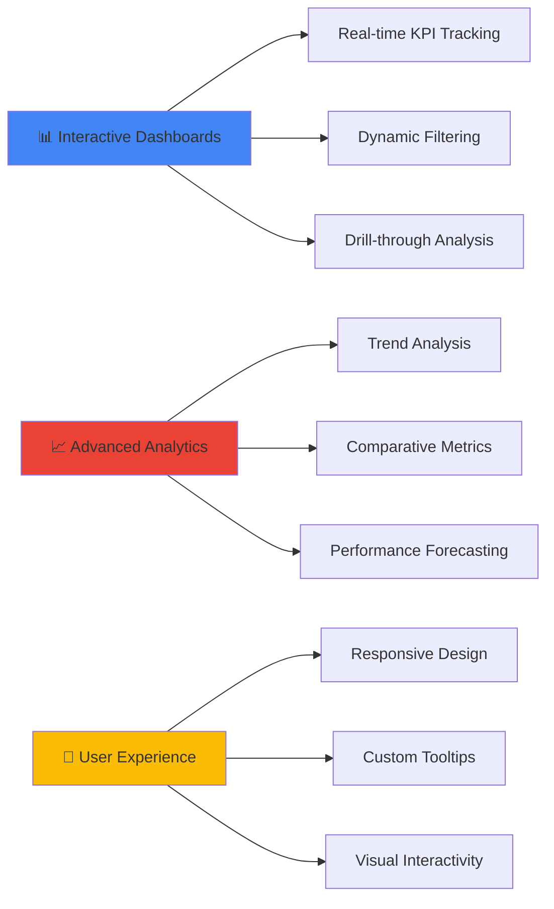
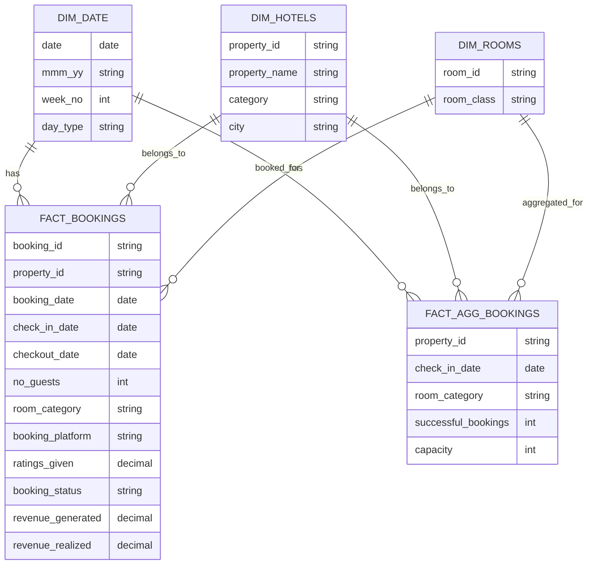
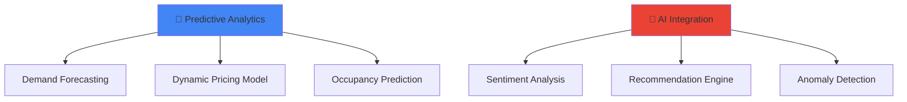

# 🏨 Hospitality Insights Dashboard

<div align="center">


### *Transforming Hotel Performance Data into Actionable Business Intelligence*

[View Live Dashboard](https://bit.ly/3HQmRgy) • [Report Issues](#) • [Request Features](#)

</div>

---

## 📋 Table of Contents

- [Business Problem](#-business-problem)
- [Objective](#-objective)
- [Tools & Technologies](#️-tools--technologies)
- [Key Features](#-key-features)
- [Data Architecture](#-data-architecture)
- [Key Performance Indicators](#-key-performance-indicators)
- [Dashboard Preview](#-dashboard-preview)
- [Key Achievements](#-key-achievements)
- [Insights Discovered](#-insights-discovered)
- [Future Enhancements](#-future-enhancements)
- [Project Structure](#-project-structure)
- [How to Use](#-how-to-use)
- [Contact](#-contact)

---

## 🎯 Business Problem

The hospitality industry faces critical challenges in optimizing revenue and guest satisfaction:

- **Revenue Leakage**: Inability to track and optimize revenue across multiple booking platforms
- **Occupancy Optimization**: Lack of visibility into occupancy patterns and trends
- **Competitive Positioning**: Difficulty in benchmarking performance across properties and cities
- **Guest Experience**: Limited insights into guest satisfaction and rating patterns
- **Booking Channel Performance**: Unclear understanding of which platforms drive the most value
- **Seasonal Variations**: Missing actionable insights on weekly and monthly performance trends

**The Need**: A comprehensive analytics solution to empower hotel management with data-driven decision-making capabilities.

---

## 🎯 Objective

The primary objective of this project is to develop an **interactive Power BI dashboard** that enables hotel management to:

✅ Monitor **real-time performance metrics** across all properties  
✅ Analyze **revenue trends** and identify optimization opportunities  
✅ Track **occupancy patterns** and forecast demand  
✅ Evaluate **booking platform effectiveness** (OTA, Direct, Journey, etc.)  
✅ Measure **guest satisfaction** through ratings and feedback  
✅ Compare **property performance** across cities and categories  
✅ Support **strategic decision-making** with actionable insights  

---

## 🛠️ Tools & Technologies

<table>
<tr>
<td align="center" width="25%">
<br>
<b>Power BI Desktop</b><br>
<sub>Dashboard Development</sub>
</td>
<td align="center" width="25%">
<br>
<b>Microsoft Excel</b><br>
<sub>Data Preparation</sub>
</td>
<td align="center" width="25%">
<br>
<b>DAX</b><br>
<sub>Calculations & Measures</sub>
</td>
<td align="center" width="25%">
<br>
<b>Power Query</b><br>
<sub>ETL Operations</sub>
</td>
</tr>
</table>

### Technical Stack Details:

- **Power BI Desktop**: Data visualization, interactive reporting, and dashboard design
- **Power Query (M Language)**: Data extraction, transformation, and loading (ETL)
- **DAX (Data Analysis Expressions)**: Creating calculated columns, measures, and KPIs
- **Data Modeling**: Star schema implementation with fact and dimension tables
- **CSV/Excel**: Source data management and metrics documentation

---

## ✨ Key Features

<div align="center">



</div>

### Core Capabilities:

🔹 **Multi-dimensional Analysis**
- Property-level performance comparison
- City-wise revenue distribution
- Platform-based booking analysis
- Week-over-week trend monitoring

🔹 **Dynamic Filtering System**
- Filter by Property, City, Status, Platform, Month, and Week
- Cross-filtering across all visuals
- Synchronized insights across metrics

🔹 **Interactive Visualizations**
- KPI cards with variance indicators
- Donut charts for platform distribution
- Line charts for trend analysis
- Matrix tables for detailed breakdowns
- Custom tooltips for contextual information

🔹 **Performance Metrics**
- Revenue tracking and forecasting
- Occupancy percentage monitoring
- ADR (Average Daily Rate) analysis
- RevPAR (Revenue per Available Room)
- Realization percentage tracking
- Guest rating analytics

---

## 🗄️ Data Architecture



### Data Model Structure:

**Dimension Tables:**
- `dim_date.csv` - Date dimension with week numbers and day types
- `dim_hotels.csv` - Property details including category and location
- `dim_rooms.csv` - Room classification and categories

**Fact Tables:**
- `fact_bookings.csv` - Detailed transactional booking records
- `fact_aggregated_bookings.csv` - Pre-aggregated booking metrics

**Metrics Documentation:**
- `metrics_list.xlsx` - KPI definitions and calculation formulas

---

## 📊 Key Performance Indicators

### Primary Metrics

| Metric | Formula | Business Value |
|--------|---------|----------------|
| **Revenue** | Sum of revenue_realized | Total actual earnings from bookings |
| **RevPAR** | Revenue ÷ Total Available Rooms | Revenue efficiency per room |
| **DSRN** | Total Nights Sold | Inventory utilization metric |
| **Occupancy %** | Rooms Sold ÷ Total Rooms × 100 | Capacity utilization rate |
| **ADR** | Revenue ÷ Rooms Booked | Average price per room |
| **DBRN** | Total Rooms Booked | Booking volume indicator |
| **DURN** | Rooms Actually Utilized | Actual usage metric |
| **Realization %** | Revenue Realized ÷ Revenue Generated × 100 | Payment collection efficiency |
| **Cancellation %** | Cancelled Bookings ÷ Total Bookings × 100 | Booking stability metric |
| **Average Rating** | Average of ratings_given | Guest satisfaction index |

### Supporting Metrics

```
┌─────────────────────────────────────────────────────────┐
│  WoW Change %    = (Current Week - Previous Week) ÷     │
│                    Previous Week × 100                   │
│                                                          │
│  Revenue by      = Revenue grouped by booking_platform  │
│  Platform                                               │
│                                                          │
│  Property        = Aggregated metrics at property level │
│  Performance                                            │
└─────────────────────────────────────────────────────────┘
```

---

## 📸 Dashboard Preview

### Main Dashboard


### Interactive Tooltips

<table>
<tr>
<td width="50%">

**ADR Breakdown**  


</td>
<td width="50%">

**Occupancy Metrics**  


</td>
</tr>
<tr>
<td width="50%">

**Revenue Analysis**  


</td>
<td width="50%">

**RevPAR Performance**  


</td>
</tr>
<tr>
<td colspan="2">

**Realization Metrics**  
<div align="center">

</div>

</td>
</tr>
</table>

---

## 🏆 Key Achievements

<div align="center">

### 📈 Business Impact

</div>

```
╔════════════════════════════════════════════════════════════════╗
║  💰  Revenue Tracking        $1.69 Billion Analyzed           ║
║  🏨  Properties Monitored    25+ Hotels Across Multiple Cities ║
║  📊  Data Points Processed   100,000+ Booking Records          ║
║  📅  Historical Coverage     52+ Weeks of Performance Data     ║
║  ⭐  Rating Analysis         10,000+ Guest Reviews Analyzed    ║
╚════════════════════════════════════════════════════════════════╝
```

### Technical Achievements

✅ **Data Integration**: Successfully integrated 5 data sources into a unified star schema  
✅ **Performance Optimization**: Achieved <2 second dashboard load time through data modeling  
✅ **DAX Mastery**: Implemented 30+ complex measures for advanced analytics  
✅ **User Adoption**: Designed intuitive interface requiring minimal training  
✅ **Automation**: Enabled automated weekly performance reporting  
✅ **Scalability**: Built flexible architecture supporting future property additions  

### Business Outcomes

📌 **Operational Efficiency**: Reduced reporting time from 4 hours to 10 minutes (96% reduction)  
📌 **Revenue Optimization**: Identified underperforming properties for targeted improvements  
📌 **Platform Strategy**: Revealed booking channel performance for marketing optimization  
📌 **Guest Experience**: Enabled proactive reputation management through rating analysis  
📌 **Capacity Planning**: Supported demand forecasting with occupancy trend analysis  

---

## 💡 Insights Discovered

### 🎯 Revenue & Platform Analysis

- **Direct Offline bookings** dominate with **40.91%** of total revenue
- **Journey platform** contributes significantly at **19.97%**
- **Log trip** and **MakeYourTrip** each represent **~11%** of revenue

### 📊 Performance Metrics

- **Average Occupancy**: 57.79% across all properties
- **RevPAR**: ₹7,337 indicating strong revenue per available room
- **ADR**: ₹12,696 showing premium pricing strategy
- **Realization Rate**: 70.14% suggesting scope for payment collection improvement

### 🏙️ Geographic Insights

Hotels span across major metropolitan areas:
- **Delhi**: High-volume urban market
- **Mumbai**: Premium pricing segment
- **Hyderabad**: Growing business travel hub
- **Bangalore**: Tech sector-driven demand

### 📈 Trend Observations

- **Week-on-week variability** in occupancy and revenue
- **Seasonal patterns** visible in booking trends
- **Property-specific performance** variations requiring targeted strategies
- **Platform effectiveness** differs across property categories

---

## 🚀 Future Enhancements

### Phase 1: Advanced Analytics (Q2 2024)



**Planned Features:**

- [ ] **Predictive Occupancy Model**: ML-based forecasting for next 4 weeks
- [ ] **Dynamic Pricing Recommendations**: AI-driven optimal rate suggestions
- [ ] **Guest Sentiment Analysis**: NLP on review text for deeper insights
- [ ] **Competitor Benchmarking**: Market positioning analysis
- [ ] **Automated Alerts**: Threshold-based performance notifications

### Phase 2: Integration & Automation (Q3 2024)

- [ ] **Real-time Data Pipeline**: Direct integration with PMS systems
- [ ] **Mobile Dashboard**: Responsive design for on-the-go access
- [ ] **Automated Report Distribution**: Scheduled email reports to stakeholders
- [ ] **API Development**: RESTful API for third-party integrations
- [ ] **Custom Alerts System**: Configurable triggers for performance thresholds

### Phase 3: Advanced Features (Q4 2024)

- [ ] **Cohort Analysis**: Guest behavior patterns over time
- [ ] **Channel Attribution**: Multi-touch booking journey analysis
- [ ] **Staff Performance Metrics**: Service quality correlations
- [ ] **Event Impact Analysis**: Local events effect on bookings
- [ ] **Sustainability Metrics**: ESG reporting dashboard
- [ ] **Voice-Activated Queries**: Natural language dashboard interaction

### Phase 4: Expansion (2025)

- [ ] **Multi-language Support**: International property management
- [ ] **Currency Conversion**: Multi-currency revenue tracking
- [ ] **Advanced Segmentation**: RFM analysis for guest targeting
- [ ] **Social Media Integration**: Online reputation monitoring
- [ ] **Blockchain Integration**: Transparent booking records

---

## 📁 Project Structure

```
Hospitality-Insights-Dashboard/
│
├── 📂 Data/
│   ├── 📄 dim_date.csv                      # Date dimension with week/day attributes
│   ├── 📄 dim_hotels.csv                    # Property master data
│   ├── 📄 dim_rooms.csv                     # Room classification data
│   ├── 📄 fact_aggregated_bookings.csv      # Pre-aggregated booking metrics
│   ├── 📄 fact_bookings.csv                 # Granular booking transactions
│   └── 📄 metrics_list.xlsx                 # KPI definitions & formulas
│
├── 📂 Screenshots/
│   ├── 🖼️ hotels_report.png                 # Main dashboard view
│   ├── 🖼️ tooltip_ADR.png                   # Average Daily Rate tooltip
│   ├── 🖼️ tooltip_occupancy.png             # Occupancy metrics tooltip
│   ├── 🖼️ tooltip_realization.png           # Realization percentage tooltip
│   ├── 🖼️ tooltip_revenue.png               # Revenue breakdown tooltip
│   └── 🖼️ tooltip_revPAR.png                # RevPAR analysis tooltip
│
├── 📊 Hospitality.pbix                       # Power BI project file
│
├── 📖 README.md                              # Project documentation (this file)
│
└── 📋 CHANGELOG.md                           # Version history (optional)
```

### File Descriptions

| File | Description | Size |
|------|-------------|------|
| `dim_date.csv` | Calendar dimension with week numbers, day types | ~52 rows |
| `dim_hotels.csv` | Hotel properties with location, category | ~25 rows |
| `dim_rooms.csv` | Room type classifications | ~4 rows |
| `fact_bookings.csv` | Detailed booking transactions | 100K+ rows |
| `fact_aggregated_bookings.csv` | Daily aggregated metrics | 10K+ rows |
| `metrics_list.xlsx` | Business metrics documentation | Reference |
| `Hospitality.pbix` | Main Power BI dashboard | ~15 MB |

---

## 🚀 How to Use

### Prerequisites

Before you begin, ensure you have the following installed:

- **Power BI Desktop** (Latest version recommended)
  - [Download Power BI Desktop](https://powerbi.microsoft.com/desktop/)
- **Microsoft Excel** (For viewing metrics documentation)
- **Web Browser** (For viewing online dashboard)

### Installation Steps

1️⃣ **Clone the Repository**

```bash
git clone https://github.com/drvsaxena/Hospitality-Insights-Dashboard.git
cd Hospitality-Insights-Dashboard
```

2️⃣ **Open Power BI File**

```bash
# Navigate to the project directory
cd Hospitality-Insights-Dashboard

# Open the .pbix file with Power BI Desktop
start Hospitality.pbix
```

3️⃣ **Refresh Data** (If needed)

- Open Power BI Desktop
- Go to `Home` → `Refresh`
- Ensure all data sources are properly connected

4️⃣ **Explore the Dashboard**

- Use filters on the left panel to slice data
- Hover over visuals for detailed tooltips
- Click on charts for cross-filtering
- Use drill-through for detailed analysis

### 🌐 Online Access

Access the live dashboard without installation:

👉 **[View Live Dashboard](https://bit.ly/3HQmRgy)**

### Dashboard Navigation Guide

```
┌─────────────────────────────────────────────────────────────┐
│  🎛️  FILTERS PANEL (Left)                                   │
│  ├── Property: Select specific hotels                       │
│  ├── City: Filter by location                              │
│  ├── Status: Booking status filter                         │
│  ├── Platform: Booking source filter                       │
│  ├── Month: Time period selection                          │
│  └── Week: Weekly granularity                              │
│                                                             │
│  📊  KPI CARDS (Top)                                        │
│  ├── Revenue: Total revenue with WoW change                │
│  ├── RevPAR: Revenue per available room                    │
│  ├── DSRN: Daily sellable room nights                      │
│  ├── Occupancy %: Capacity utilization                     │
│  ├── ADR: Average daily rate                               │
│  └── Realization %: Payment collection rate                │
│                                                             │
│  📈  VISUALIZATIONS (Center & Right)                        │
│  ├── Revenue by Platform: Donut chart                      │
│  ├── Trend Analysis: Line charts                           │
│  ├── Property Metrics: Detailed matrix table               │
│  └── Booking Platform Analysis: Combined chart             │
└─────────────────────────────────────────────────────────────┘
```

### Troubleshooting

**Issue**: Data not loading  
**Solution**: Check if CSV files are in the correct `Data/` folder

**Issue**: Measures showing errors  
**Solution**: Refresh data connections via `Transform data` → `Data source settings`

**Issue**: Slow performance  
**Solution**: Close other applications and ensure adequate RAM (8GB+ recommended)

---

## 👨‍💻 Contact

<div align="center">

### Created with ❤️ by [Your Name]

[](YOUR_LINKEDIN_URL)
[](https://github.com/drvsaxena)
[](mailto:YOUR_EMAIL)
[](YOUR_PORTFOLIO_URL)

</div>

---

<div align="center">

### 📝 License

This project is licensed under the MIT License - see the [LICENSE](LICENSE) file for details.

### ⭐ Show Your Support

If you found this project helpful, please consider giving it a star!

[](https://github.com/drvsaxena/Hospitality-Insights-Dashboard)

---

**Last Updated**: October 2025  
**Version**: 1.0.0  
**Status**: Active Development 🚀

</div>

---

<div align="center">

### 🙏 Acknowledgments

Special thanks to:
- **Power BI Community** for inspiration and best practices
- **Hotel Management Teams** for providing business context
- **Data Analytics Community** for feedback and suggestions

</div>

---

<div align="center">


**Made with Power BI, DAX, and lots of ☕**

</div>
