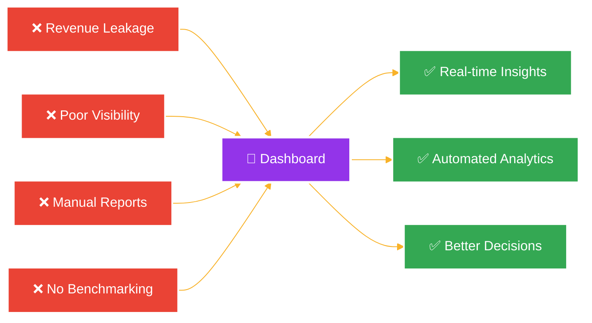
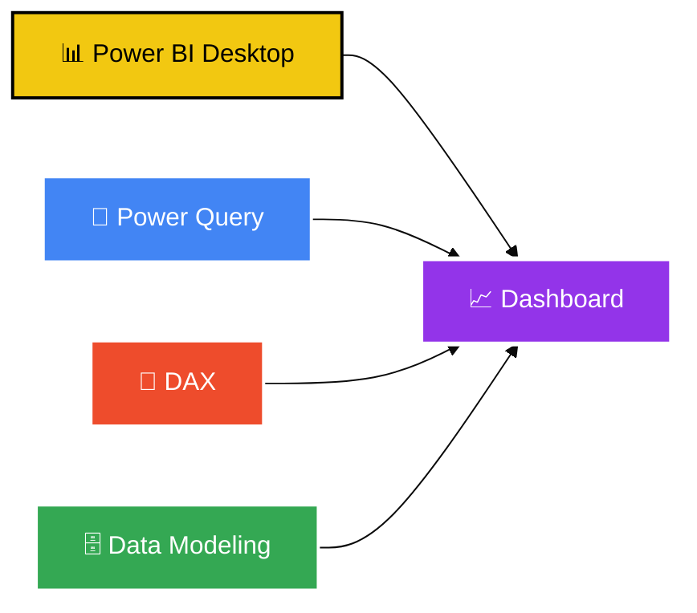
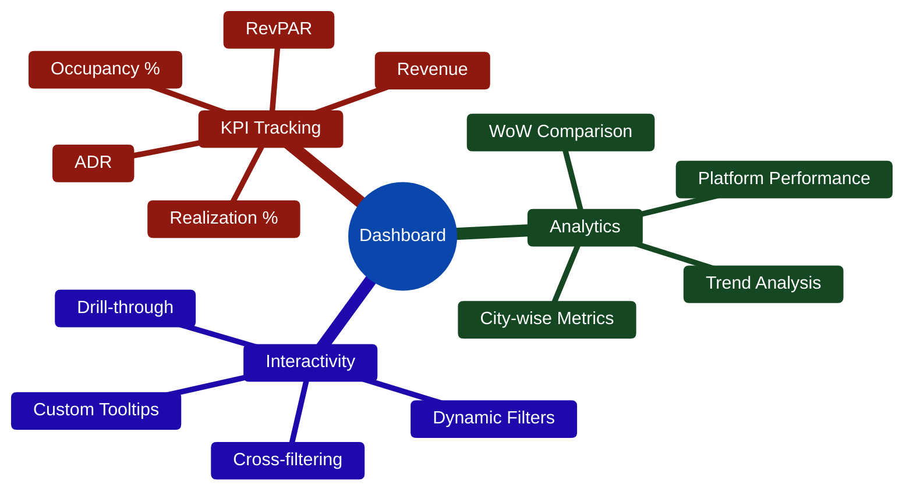
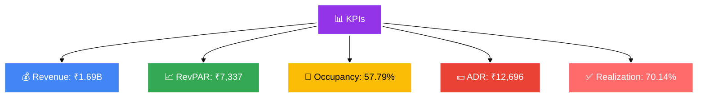
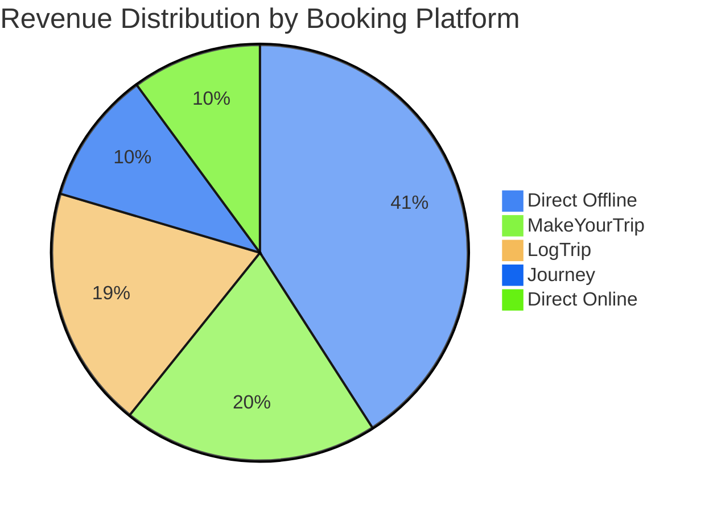

# 🏨 Hospitality Insights Dashboard

<div align="center">


### *Data-Driven Hotel Performance Analytics*

[📊 View Live Dashboard](https://bit.ly/3HQmRgy)


</div>

---

## 🎯 Business Problem

<div align="center">



</div>

The hospitality industry struggles with:
- ❌ Revenue leakage across multiple booking platforms
- ❌ Lack of real-time occupancy insights
- ❌ Poor visibility into guest satisfaction trends
- ❌ Inefficient booking channel performance tracking
- ❌ Limited competitive benchmarking capabilities

**Solution**: An interactive Power BI dashboard that transforms raw hotel data into actionable business intelligence.

---

## 📌 Objective

Build a comprehensive analytics dashboard to:
- 📈 Monitor key performance metrics (Revenue, RevPAR, ADR, Occupancy)
- 🏨 Compare property performance across cities
- 📊 Analyze booking trends and platform effectiveness
- ⭐ Track guest satisfaction and ratings
- 💡 Enable data-driven decision making for hotel management

---

## 🛠️ Tools & Technologies

<div align="center">



| Tool | Purpose |
|------|---------|
| **Power BI Desktop** | Dashboard design & data visualization |
| **Power Query** | Data transformation & ETL |
| **DAX** | Advanced calculations & KPIs |
| **Data Modeling** | Star schema implementation |

</div>

---

## ✨ Key Features

<div align="center">

<picture>
  <source media="(prefers-color-scheme: dark)" srcset="https://via.placeholder.com/800x400/1e1e1e/ffffff?text=Dashboard+Features+Mindmap">
  <source media="(prefers-color-scheme: light)" srcset="https://via.placeholder.com/800x400/ffffff/000000?text=Dashboard+Features+Mindmap">
  
</picture>




</div>

**Core Capabilities:**
- 🎯 **6 Key KPI Cards** with week-on-week change indicators
- 🗓️ **Multi-dimensional Filters**: Property, City, Platform, Month, Week
- 📊 **Revenue Distribution**: Platform-wise breakdown with donut chart
- 📈 **Trend Analysis**: Occupancy & ADR trends over time
- 📋 **Property Performance Matrix**: Detailed metrics for 25+ hotels
- 💬 **Interactive Tooltips**: Contextual insights on hover

---

## 📊 Key Performance Indicators

<div align="center">



</div>

| Metric | Formula | Insight |
|--------|---------|---------|
| **Revenue** | Sum(revenue_realized) | Total earnings |
| **RevPAR** | Revenue ÷ Available Rooms | Revenue efficiency |
| **Occupancy %** | Rooms Sold ÷ Total Rooms × 100 | Capacity utilization |
| **ADR** | Revenue ÷ Rooms Booked | Average room rate |
| **DSRN** | Daily Sellable Room Nights | Inventory metric |
| **Realization %** | Revenue Realized ÷ Generated × 100 | Collection efficiency |

---

## 📸 Dashboard Preview

<div align="center">


</div>

---

## 🏆 Key Achievements

<div align="center">

```
╔══════════════════════════════════════════════════════╗
║  💰  $1.69 Billion Revenue Analyzed                 ║
║  🏨  25+ Properties Monitored                       ║
║  📊  100K+ Booking Records Processed                ║
║  ⚡  96% Reduction in Reporting Time                ║
║  📈  70.14% Average Realization Rate                ║
╚══════════════════════════════════════════════════════╝
```

</div>

**Business Impact:**
✅ Reduced manual reporting from 4 hours to 10 minutes  
✅ Identified underperforming properties for optimization  
✅ Enabled platform-wise booking strategy  
✅ Real-time guest satisfaction monitoring  
✅ Data-driven revenue management decisions  

---

## 💡 Key Insights

<div align="center">



</div>

- 📌 **Direct Offline** drives 40.91% of revenue (highest channel)
- 📌 **57.79% Average Occupancy** across all properties
- 📌 **₹12,696 ADR** indicates premium positioning
- 📌 **70.14% Realization** shows room for payment improvement
- 📌 **Delhi, Mumbai, Hyderabad, Bangalore** are key markets

---

## 🚀 Future Enhancements

- [ ] 🤖 **Predictive Analytics**: AI-based occupancy forecasting
- [ ] 💰 **Dynamic Pricing**: Smart rate recommendations
- [ ] 📱 **Mobile Dashboard**: Responsive design for on-the-go
- [ ] 🔔 **Automated Alerts**: Performance threshold notifications
- [ ] 🌐 **Real-time Integration**: Live PMS data connection
- [ ] 🎯 **Sentiment Analysis**: NLP on guest reviews

---

## 📁 Project Structure

```
Hospitality-Insights-Dashboard/
├── Data/
│   ├── dim_date.csv                      # Date dimension
│   ├── dim_hotels.csv                    # Property data
│   ├── dim_rooms.csv                     # Room types
│   ├── fact_bookings.csv                 # Booking transactions
│   ├── fact_aggregated_bookings.csv      # Aggregated metrics
│   └── metrics_list.xlsx                 # KPI definitions
├── Screenshots/
│   ├── hotels_report.png                 # Main dashboard
│   └── tooltip_*.png                     # Interactive tooltips
└── Hospitality.pbix                      # Power BI file
```

---

<div align="center">


### ⭐ Star this repo if you found it helpful!

**Made with Power BI 💙 and DAX magic ✨**

</div>
